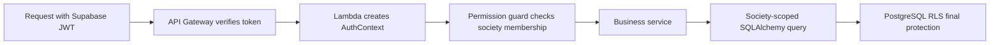

I am wondering: how do we implement role-based authentication? What is the best way to do it? Is it just creating a new table and checking the role every time or is there any more sophisticated approach here? 

10:43 AM

Worked for 1m 43s

Role-based access control is authorization, not authentication:
Authentication: “Who is this?” — handled by Supabase Auth.
Authorization: “What can this person do in this society?” — handled by your backend and database.
For your application, the best approach is layered RBAC with society-scoped memberships, permission checks in FastAPI, and PostgreSQL Row Level Security as a safety net.

1. Do not store one role directly on the user
Avoid this:
users
- id
- mobile
- role = "admin"
It fails because a person could be:
A resident in Society A.
A committee member in Society B.
A collector in Society C.
A platform administrator globally.
The role belongs to the relationship between a user and a society.
2. Recommended database structure
Identity
profiles
- id
- auth_user_id        -- Supabase Auth user ID
- name
- mobile
- status
Supabase owns authentication credentials and passwords. profiles contains only application data.
Society membership
society_memberships
- id
- society_id
- user_id
- status
- joined_at
- ended_at
Roles
roles
- id
- key
- name
Seeded values:
society_admin
committee_member
collector
resident
Role assignments
membership_roles
- membership_id
- role_id
The combination of membership_id and role_id should be unique.
A user can consequently have several roles in one society:
Hakimuddin
Society: Lotus Divine
Roles:
- resident
- committee_member
Platform administrators
Keep the SaaS-level administrator separate:
platform_admins
- user_id
- granted_by
- granted_at
- revoked_at
Do not represent a platform administrator as a membership in every society.
3. Permissions
Roles are convenient names; permissions are the actual operations.
Suggested Phase 1 permissions:
society:configure
society:manage_members
society:manage_roles
unit:create
unit:update
billing_rule:create
billing_rule:update
charge:generate
receipt:create
receipt:view
receipt:reverse
expense:create
expense:view
expense:reverse
report:view
report:export
cash_handover:create
cash_handover:confirm
import:create
import:approve
audit:view
Phase 1 recommendation: define permissions in Python
Keep role assignments in the database, but maintain the role-to-permission mapping in code:
ROLE_PERMISSIONS = {
    "society_admin": {
        "society:configure",
        "society:manage_members",
        "society:manage_roles",
        "billing_rule:create",
        "billing_rule:update",
        "receipt:create",
        "receipt:view",
        "receipt:reverse",
        "expense:create",
        "expense:view",
        "expense:reverse",
        "report:view",
        "report:export",
        "import:create",
        "import:approve",
        "audit:view",
    },
    "committee_member": {
        "receipt:create",
        "receipt:view",
        "expense:create",
        "expense:view",
        "report:view",
        "report:export",
        "cash_handover:confirm",
    },
    "collector": {
        "receipt:create",
        "receipt:view",
        "cash_handover:create",
    },
    "resident": {
        "own_ledger:view",
        "own_receipt:view",
    },
}
This is preferable initially because:
Your roles are fixed.
Permission changes go through code review.
No one can accidentally grant a dangerous permission through an admin screen.
It is easy to test.
Later, if societies need custom roles, migrate the mapping to:
permissions
role_permissions
custom_roles
4. Request authorization flow
Step 1: Verify the Supabase token
After login, the frontend sends:
Authorization: Bearer <supabase-access-token>
The token contains the Supabase user ID in the sub claim.
Use an asymmetric Supabase signing key and verify the token through its JWKS endpoint. Supabase currently exposes public verification keys under the project’s Auth JWKS URL. Supabase JWT documentation
API Gateway can perform JWT validation, including signature, issuer, audience and expiry, when compatible RSA signing keys are used. AWS API Gateway JWT authorizer
If the Supabase signing algorithm is not compatible with API Gateway’s JWT authorizer, validate the token in FastAPI using a standard Python JWT library.
Step 2: Build an authentication context
Lambda creates one request-scoped object:
@dataclass
class AuthContext:
    user_id: UUID
    society_id: UUID | None
    roles: set[str]
    permissions: set[str]
    is_platform_admin: bool
Never accept user_id from the request body. It must always come from the verified JWT.
Step 3: Check membership
For a request such as:
POST /societies/{society_id}/receipts
The backend checks:
Does this user have an active membership in this society?
If not:
403 Forbidden
A platform administrator can bypass the society-membership requirement, but that access should be audited.
Step 4: Check permission
Use a reusable FastAPI dependency:
@router.post("/societies/{society_id}/receipts")
async def create_receipt(
    request: ReceiptCreate,
    auth=Depends(require_permission("receipt:create")),
):
    ...
All authorization logic remains centralized. Individual route handlers do not manually compare role strings.
5. RBAC alone is not sufficient
Some rules depend on the resource, not merely the role.
For example:
A resident may view receipts—but only receipts belonging to their flats.
A collector may reverse a draft created by themselves—but not another collector’s posted receipt.
A committee member can work only within their society.
An inactive tenant must no longer see newly generated charges.
These are attribute or relationship checks:
can_view_receipt(
    user_id=current_user.id,
    receipt_id=receipt.id,
    assigned_unit_ids=current_user.unit_ids,
)
Therefore, your authorization system is:
RBAC + society scope + resource ownership
6. Always scope SQLAlchemy queries
Never retrieve a record by its ID alone:
# Dangerous
select(Receipt).where(Receipt.id == receipt_id)
Use:
select(Receipt).where(
    Receipt.id == receipt_id,
    Receipt.society_id == auth.society_id,
)
Otherwise, a Society A administrator who learns a Society B receipt ID might access it.
Create society-scoped repositories:
class ReceiptRepository:
    def __init__(self, session, society_id):
        self.session = session
        self.society_id = society_id

    async def get(self, receipt_id):
        return await self.session.scalar(
            select(Receipt).where(
                Receipt.id == receipt_id,
                Receipt.society_id == self.society_id,
            )
        )
This makes accidental unscoped queries harder to write.
7. Add Row Level Security
Backend checks are the primary authorization layer. PostgreSQL RLS should provide a second layer protecting society isolation.
Supabase recommends RLS for row-level authorization and warns against storing authorization data in user-editable metadata. Supabase RLS documentation
Because SQLAlchemy connects directly to PostgreSQL, auth.uid() is not automatically populated as it is with the Supabase Data API. At the beginning of each transaction, set the authenticated identity locally:
SELECT set_config('app.user_id', :user_id, true);
Then the policy can verify membership:
ALTER TABLE receipts ENABLE ROW LEVEL SECURITY;

CREATE POLICY receipts_society_isolation
ON receipts
USING (
    EXISTS (
        SELECT 1
        FROM society_memberships sm
        WHERE sm.user_id =
              current_setting('app.user_id', true)::uuid
          AND sm.society_id = receipts.society_id
          AND sm.status = 'active'
    )
)
WITH CHECK (
    EXISTS (
        SELECT 1
        FROM society_memberships sm
        WHERE sm.user_id =
              current_setting('app.user_id', true)::uuid
          AND sm.society_id = receipts.society_id
          AND sm.status = 'active'
    )
);
Use a restricted PostgreSQL role such as app_api for SQLAlchemy.
Do not use:
The PostgreSQL postgres user for application requests.
A role with BYPASSRLS.
Supabase’s service-role credentials from the browser.
User-editable raw_user_meta_data for roles.
8. Should roles be placed inside the JWT?
Supabase supports custom role claims using a Custom Access Token Hook. Supabase custom-claims RBAC
However, I would not put all society roles in the JWT initially.
Problems:
Role changes are not visible until the token refreshes.
A user may belong to many societies.
The token becomes large.
Removing an administrator may not take effect immediately.
Flat assignments and tenant changes are too dynamic for token claims.
Recommended split:
JWT: identity only—sub, issuer, audience and expiry.
Database: society memberships and roles.
Backend: permissions and resource-level checks.
Optional JWT claim: global platform_admin, but sensitive requests should still confirm it in the database.
At your Phase 1 traffic level, one membership query per request is completely reasonable. Fetch membership and roles once and reuse them throughout the request. Add short-lived caching later only if measurements show it is necessary.
9. Security rules worth enforcing
Only society administrators can grant or remove roles.
Nobody can grant PLATFORM_ADMIN through the normal society UI.
Role changes must be recorded in audit_logs.
Administrator and role-change endpoints should require recent authentication.
Society and platform administrators should eventually use MFA.
Removing a membership should immediately block API access.
Every write should store created_by.
Every reversal should store reversed_by, time and reason.
Frontend permission hiding is only a convenience—the backend must always enforce it.
Recommended Phase 1 implementation
Use this combination:
Supabase Auth authenticates the user.
API Gateway or Lambda verifies the JWT.
society_memberships and membership_roles store assignments.
Python contains the fixed role-to-permission mapping.
FastAPI dependencies enforce permissions.
Service methods enforce ownership and flat-level rules.
Every SQLAlchemy query is society-scoped.
PostgreSQL RLS protects against cross-society access.
Audit logs capture every role change and privileged action.
That is sophisticated enough to be secure and scalable, while remaining understandable for an MVP.

10:44 AM

profiles
- id
- auth_user_id        -- Supabase Auth user ID
- name
- mobile
- status
Why do we need to create a separate profile table? Can't we just get away with the user's table, which already stores the user ID, auth name, mobile status, and everything? 

4:06 PM

Worked for 55s

Yes—we can remove profiles. I used it as shorthand for an application-owned user record, but for your society model, a persons table is a better abstraction.
What we should not do is use Supabase’s internal auth.users table as the only business record.
Why auth.users alone is insufficient
auth.users answers authentication questions:
What is the verified login number?
What is the password identity?
Is the mobile verified?
When was the last login?
What is the Supabase user ID?
It does not cleanly answer your business questions:
Which society does this person belong to?
Which flat do they occupy?
Are they an owner or tenant?
When did their tenancy begin and end?
Are they active in this particular society?
What name should appear on receipts?
Which number should receive WhatsApp messages?
Does the person exist in your records even though they have never registered?
Supabase also treats auth.users as an internally managed authentication table. The Auth schema is not exposed through its generated API, and Supabase recommends referencing only its stable primary key from application-owned tables. Supabase user-management guidance
Better schema for your application
Use auth.users for authentication and persons for society data:
auth.users                     -- managed by Supabase
- id
- phone
- phone_confirmed_at
- password identity
- authentication status
- last_sign_in_at
persons                        -- managed by our application
- id
- auth_user_id nullable
- full_name
- whatsapp_mobile
- status
- created_at
society_memberships
- id
- society_id
- person_id
- status
unit_assignments
- id
- unit_id
- person_id
- relationship_type           -- OWNER, TENANT, FAMILY
- effective_from
- effective_until
- is_primary_payer
- is_notification_recipient
membership_roles
- membership_id
- role_id
The important field is:
persons.auth_user_id
It is nullable because a person may exist before registering.
Why that matters for your workflow
Suppose the society administrator initially enters:
Name: Hakimuddin
Mobile: +91XXXXXXXXXX
Flat: FN207
Relationship: Tenant
At this moment:
persons.auth_user_id = NULL
The society can still:
Generate maintenance charges.
Record payments.
Issue receipts.
Send WhatsApp notifications.
Show the flat in outstanding reports.
Later, when Hakimuddin registers and verifies his phone:
Supabase creates the auth.users record.
Backend identifies the matching pending person.
persons.auth_user_id is set to the Supabase user ID.
The person can now log in.
Existing flat history, charges and receipts remain attached to the same person.
If we relied only on auth.users, every resident would have to register before the society could add them or collect maintenance from them.
Login authorization flow
After login:
Supabase JWT.sub
       ↓
persons.auth_user_id
       ↓
society_memberships
       ↓
membership_roles
       ↓
permissions
For example:
JWT sub: 2ec1...
Person: Hakimuddin
Society membership: Lotus Divine
Roles:
- resident
- committee_member
Do we duplicate the phone number?
Preferably, distinguish the two purposes:
auth.users.phone: verified login identity.
persons.whatsapp_mobile: operational contact number.
They may initially be identical, but they are conceptually different. A resident may later want WhatsApp notifications sent to a spouse or family number while continuing to log in with their own number.
If Phase 1 must be extremely minimal, we can omit whatsapp_mobile and use the verified Auth phone. Add a separate notification number later.
What about the person’s name?
Do not rely exclusively on auth.users.raw_user_meta_data for receipt names or society records. Supabase notes that normal user metadata can be modified by the authenticated user. A resident should not be able to change the official name associated with society receipts without a controlled application update.
Store the society-recognized name in persons.full_name.
What about status?
There are different statuses:
Authentication status: can this identity log in?
Person status: is this person archived?
Membership status: are they active in this society?
Unit-assignment status: do they currently occupy this flat?
One status field in auth.users cannot represent all of these.
Final recommendation
Remove profiles and use this:
create table persons (
    id uuid primary key,
    auth_user_id uuid unique
        references auth.users(id)
        on delete set null,
    full_name text not null,
    whatsapp_mobile text,
    status text not null default 'active',
    created_at timestamptz not null default now()
);
Then reference persons.id from:
Society memberships.
Flat assignments.
Payment payer details.
Notification preferences.
Resident history.
So the answer is:
Separate profiles table: not necessary.
Application-owned person/user data: still necessary.
Supabase auth.users: authentication identity only.
Recommended replacement: persons with an optional link to auth.users.
That gives us less duplication while still supporting residents who have not registered, changing tenants, historical receipts and multi-society roles.

4:07 PM

Also you mentioned to store the role permissions in the backend APIs but Supabase has a policy kind of thing where you can do the same, which is a better approach 

4:08 PM

For your AWS Lambda + SQLAlchemy architecture, neither approach should replace the other. The best design is:
Backend permissions decide whether an operation is allowed.
Supabase/PostgreSQL RLS policies ensure the user cannot access another society’s rows.
Database constraints enforce accounting invariants.
RLS is excellent for data isolation, but it is not a complete replacement for application authorization.
Recommended responsibility split
Concern	Best location
Verify Supabase JWT	API Gateway/Lambda
Can this role create an expense?	Backend permission guard
Can this user access Society A?	Backend + RLS
Can resident view this flat?	RLS/resource relationship check
Can a posted receipt be deleted?	Backend business rule + DB constraint
Must debit equal credit?	Database constraint/transaction
Can an expense be reversed?	Backend workflow
Audit who changed a role	Backend + audit table

Why not use only Supabase policies?
Supabase policies are PostgreSQL Row Level Security policies. They answer questions about rows:
May this user SELECT this row?
May this user INSERT a row with these values?
May this user UPDATE or DELETE this row?
They are very good for rules such as:
A committee member can access receipts only from societies
where they have an active membership.
They are less convenient for application workflows such as:
A collector can receive maintenance but cannot enter expenses.
Only a society administrator can change a billing rule.
A posted payment cannot be edited; it must be reversed.
An expense cannot be posted in a locked accounting period.
A cash handover cannot exceed the collector’s unhanded cash.
A resident can download a receipt but cannot regenerate or reverse it.
You can technically express many of these in PostgreSQL functions and policies, but the authorization system becomes difficult to understand, test and debug.
Important SQLAlchemy complication
Supabase RLS works most naturally when the frontend calls Supabase’s Data API using the resident’s JWT:
Frontend → Supabase Data API → auth.uid() → RLS
Your architecture is:
Frontend → API Gateway → Lambda → SQLAlchemy → PostgreSQL
When SQLAlchemy connects directly to PostgreSQL, Supabase does not automatically know which authenticated user caused the request. Therefore, this will not automatically work:
auth.uid()
The SQLAlchemy connection is the database user—not the resident who owns the JWT.
We must explicitly pass request identity into each database transaction or use another supported mechanism.
Recommended Phase 1 design
1. Backend permission guard
Store society membership and role assignments in the database:
society_memberships
membership_roles
roles
Keep the initial role-permission mapping in Python:
ROLE_PERMISSIONS = {
    "society_admin": {
        "billing_rule:manage",
        "receipt:create",
        "receipt:reverse",
        "expense:create",
        "expense:reverse",
        "report:view",
    },
    "committee_member": {
        "receipt:create",
        "expense:create",
        "report:view",
    },
    "collector": {
        "receipt:create",
        "cash_handover:create",
    },
    "resident": {
        "own_ledger:view",
        "own_receipt:view",
    },
}
FastAPI protects routes:
@router.post("/societies/{society_id}/expenses")
async def create_expense(
    body: ExpenseCreate,
    auth=Depends(require_permission("expense:create")),
):
    ...
That makes the business-level decision easy to test.
2. Set the user context for PostgreSQL
At the beginning of every SQLAlchemy transaction:
SELECT set_config(
    'app.current_user_id',
    :user_id,
    true
);

SELECT set_config(
    'app.current_society_id',
    :society_id,
    true
);
The final true means the setting is local to the current transaction. It disappears after commit or rollback, which is important when pooled database connections are reused.
The values must come from:
user_id: verified JWT sub
society_id: society validated by the backend
Never take user_id from the request body.
3. RLS protects society boundaries
Example receipt policy:
alter table receipts enable row level security;

create policy receipts_society_access
on receipts
for select
using (
    society_id =
        current_setting(
            'app.current_society_id',
            true
        )::uuid

    and exists (
        select 1
        from society_memberships sm
        join persons p on p.id = sm.person_id
        where p.auth_user_id =
            current_setting(
                'app.current_user_id',
                true
            )::uuid
          and sm.society_id = receipts.society_id
          and sm.status = 'active'
    )
);
Add equivalent WITH CHECK policies for inserts and updates.
This means that even if a developer accidentally forgets the SQLAlchemy society filter, PostgreSQL should reject cross-society access.
Supabase recommends RLS for row-level authorization and supports role-based checks through functions and role-permission tables. Supabase RLS documentation, Supabase custom-claims RBAC
Should permissions be stored in PostgreSQL too?
There are two reasonable stages.
Phase 1: fixed roles
Use:
Role assignments in PostgreSQL.
Role-to-permission mapping in Python.
Society isolation in RLS.
This is simpler and safer because your role definitions are still evolving. Permission changes require a backend deployment and therefore receive code review and testing.
Later: configurable roles
When societies ask for custom roles such as “Accountant,” “Facility Manager” or “Assistant Treasurer,” add:
permissions
- id
- key

role_permissions
- role_id
- permission_id
Then both the backend and RLS functions can consult those tables.
For example:
has_permission(
    current_user_id,
    society_id,
    'expense:create'
)
But this should come later, when customizable roles are an actual requirement.
What about putting roles in the Supabase JWT?
Supabase allows custom claims through an Access Token Hook. RLS can then read them using auth.jwt(). This is useful for a simple global role. Supabase custom claims
I would not put all society roles in the JWT because:
A user may belong to several societies.
Role removal will not take effect until the JWT refreshes.
The JWT can grow as memberships increase.
Tenant and flat assignments change frequently.
Emergency removal of an administrator should take effect immediately.
Keep the database as the source of truth for society memberships.
A global platform_admin claim may be acceptable later, but sensitive actions should still confirm that status in the database.
Critical database-connection rule
RLS is ineffective if Lambda connects using a role that bypasses it.
Do not use for normal requests:
PostgreSQL postgres user.
A role with BYPASSRLS.
Supabase service-role access in the frontend.
Create a restricted database role such as:
app_api
It should:
Have only required table privileges.
Not own the financial tables.
Not bypass RLS.
Use Supabase’s transaction pooler.
Receive request identity through transaction-local settings.
Final recommendation
For Phase 1:
Supabase Auth
    ↓
JWT authentication
    ↓
FastAPI permission guard
    ↓
Service-level business rules
    ↓
SQLAlchemy society-scoped query
    ↓
PostgreSQL RLS
    ↓
Database constraints and audit log
So the direct answer is:
Backend-only authorization: insufficient protection against query mistakes.
RLS-only authorization: too awkward for complex business workflows.
Backend RBAC plus RLS: best for your application.
Use the backend as the understandable source of business permissions and RLS as the non-negotiable tenant-isolation safety net.

4:09 PM

Is RLS only for not exposing data to another tenant by a mistake of a backend engineer who mistakenly queries the wrong tenant ID, something like that? 
Also keep in mind that we don't need to implement the tenant role point of view yet for phase one 

4:10 PM

Yes—that is one of the main purposes of RLS in a multi-tenant application:
# Backend engineer accidentally forgets:
.where(Payment.society_id == current_society_id)
Without RLS, the query could return payments from every society. With correctly configured RLS, PostgreSQL blocks rows outside the current society even though the application query is wrong.
But RLS can also protect:
A resident from viewing another flat’s receipts.
An API endpoint that accidentally fetches an unrestricted record by ID.
Direct calls through the Supabase Data API.
Future reporting/export endpoints that forget an ownership filter.
Certain consequences of a compromised application path.
It is a database-level safety boundary—not merely a role-management feature.
For Phase 1, we can defer RLS
Because Phase 1 has:
One society.
No tenant selection.
No society-specific role assignments.
No resident portal yet.
All database access through AWS Lambda and SQLAlchemy.
No direct frontend access to Supabase tables.
Implementing RLS now would introduce additional complexity because every SQLAlchemy transaction would need to pass user/society context to PostgreSQL.
For Phase 1, this is sufficient:
Supabase Auth
    ↓
JWT verification
    ↓
Simple user roles
    ↓
FastAPI role guard
    ↓
Business service
    ↓
SQLAlchemy
    ↓
PostgreSQL
Simplified Phase 1 role schema
We do not need society memberships or tenant-scoped role assignments yet.
user_roles
- id
- user_id
- role_key
- assigned_by
- assigned_at
- revoked_at
Role values:
super_admin
committee_member
collector
resident
A user can hold multiple roles:
Hakimuddin
- resident
- committee_member
Permissions remain in the backend:
ROLE_PERMISSIONS = {
    "super_admin": {"*"},
    "committee_member": {
        "receipt:create",
        "expense:create",
        "report:view",
    },
    "collector": {
        "receipt:create",
        "cash_handover:create",
    },
    "resident": {
        "own_receipt:view",
    },
}
FastAPI checks permissions through reusable dependencies.
Still keep society_id in financial tables
Even though we are not implementing tenant-aware roles, I recommend retaining society_id on:
Flats
Charges
Payments
Expenses
Funds
Accounts
Journal entries
Reports
Imports
For Phase 1, every record will simply contain the same Lotus Divine society ID.
This is not implementing multi-tenancy; it is preserving ownership information. It prevents a large schema migration when you onboard the second society.
Phase 1 database security
Even without RLS:
Lambda should use a restricted PostgreSQL role such as app_api.
Do not connect as postgres.
Do not expose database credentials to the frontend.
Frontend must never call financial tables directly.
Every API operation must verify the Supabase JWT.
Every protected endpoint must check the user’s backend role.
Financial changes must be audited.
Posted transactions must use reversal rather than deletion.
SQLAlchemy queries should still include society_id, even though only one exists.
When we should add RLS
Introduce RLS before any of these happen:
A second society is onboarded.
Residents can access their own ledger or receipts.
Different administrators manage different societies.
The frontend directly queries Supabase.
Third parties or accountants receive API/report access.
Bulk exports operate across several societies.
At that point, migrate from:
user_roles
to:
society_memberships
membership_roles
and implement policies such as:
A user can access a financial row only when they have
an active membership in that row’s society.
What RLS does not protect
RLS does not automatically prevent:
Entering an incorrect payment amount.
A collector creating an expense if the policy permits broad writes.
Duplicate receipts.
Editing a locked accounting period.
Incorrect debit/credit calculations.
Application code using a database role that bypasses RLS.
Those remain backend business rules and database constraints.
So the revised Phase 1 decision is:
Simple global roles: yes.
Backend permission checks: yes.
society_id on business records: yes.
Tenant-aware roles: deferred.
RLS: deferred until multi-society or resident access.
Direct frontend database access: prohibited.

4:11 PM

hy